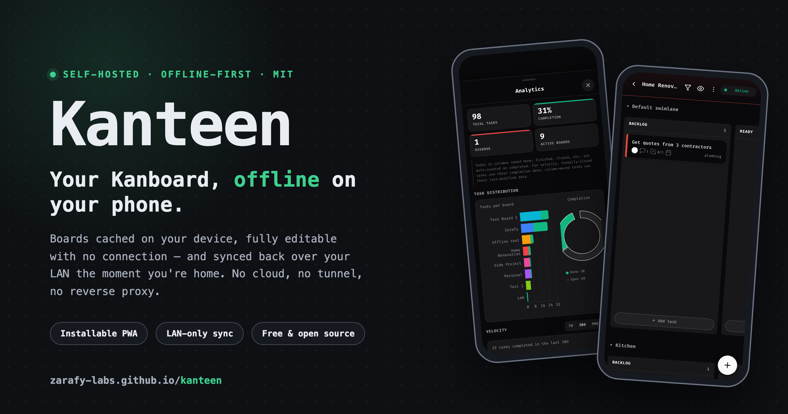
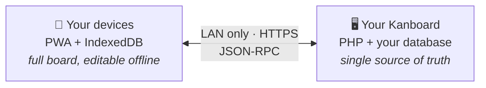
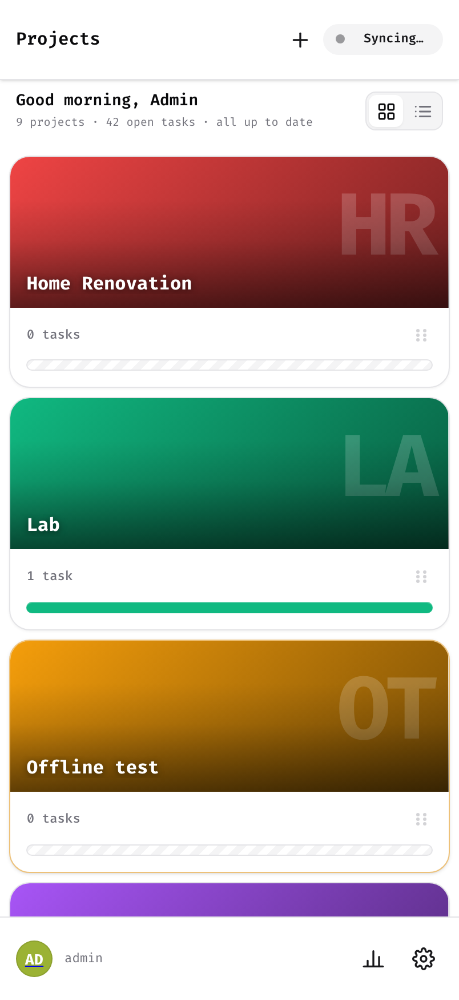
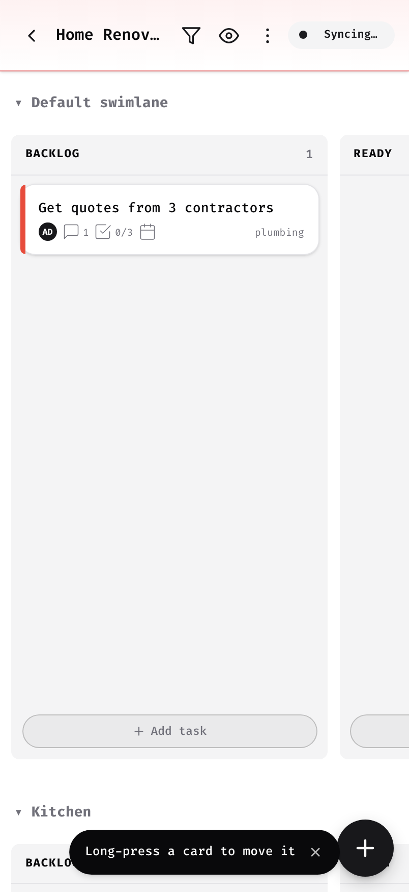
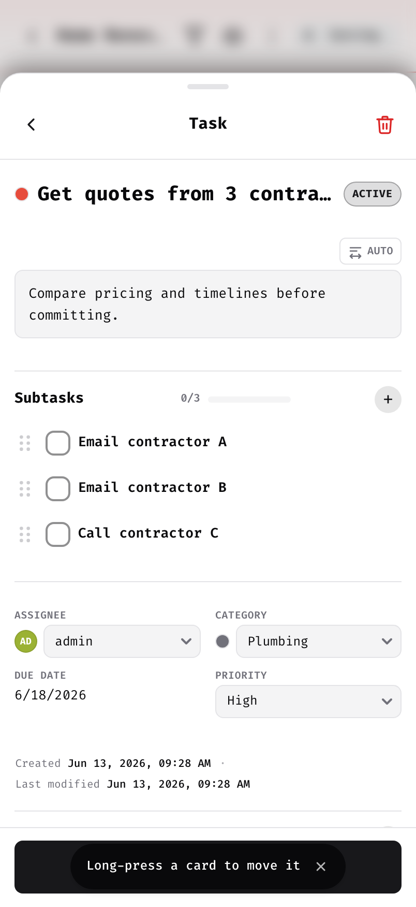
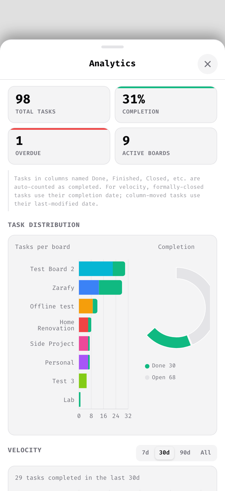
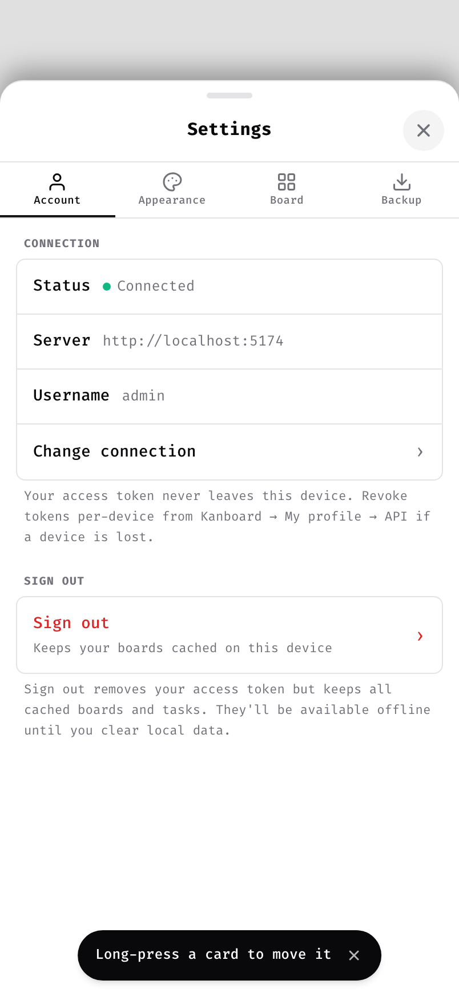

<div align="center">


# Kanteen

**Offline PWA for Kanboard**

Your boards, cached on your phone, fully editable with no connection —
and synced back over your LAN the moment you're home. Nothing ever touches the internet.

[](LICENSE)
[](https://kanboard.org)
[](https://github.com/Zarafy-labs/kanteen-offline-Kanboard/releases/latest)


[**Landing page**](https://zarafy-labs.github.io/kanteen-offline-Kanboard/) · [**Download**](https://github.com/Zarafy-labs/kanteen-offline-Kanboard/releases/latest) · [**Install**](#installation) · [**First-time setup**](#first-time-setup) · [**License**](LICENSE)

<br/>

<a href="https://zarafy-labs.github.io/kanteen-offline-Kanboard/">
  
</a>

</div>

---

## 🧩 The problem

Self-hosting Kanboard is the right call: your projects live on your own Raspberry Pi, NAS, or home server, and no cloud company ever sees them. But that choice comes with two daily frustrations:

1. **Your board vanishes when you leave the house.** On the train, at the café, in a basement dead zone — no LAN means no Kanboard. The moment you want to jot down a task is exactly the moment you can't.
2. **The stock UI fights your phone.** Kanboard was built for desktops: small tap targets, dense tables, pinch-zooming to read a card, and nothing to install on a home screen.

The usual workaround — a reverse proxy, a tunnel, a VPN overlay — solves reachability by putting your private server on the public internet. For a lot of self-hosters, that defeats the entire point.

## 💡 How Kanteen solves it

Kanteen is a Kanboard plugin that ships a local-first app. Instead of asking the server for every screen, it moves the data to you:

1. **Connect once, on your LAN.** Sign in with your Kanboard credentials and your boards download into a database *inside your browser* (IndexedDB). Install the app while you're at it.
2. **Work anywhere, connection or not.** Every read and write hits the on-device database first — the UI never waits on the network. Each edit you make offline joins an ordered queue on the device.
3. **Sync when you're back.** Kanteen probes for your server with a real API call (not the browser's unreliable "am I online?" flag). When your LAN answers, the queue replays in order, fresh server state pulls down, and if the same field changed in both places you choose the winner — yours, the server's, or a field-by-field merge.



Your server stays exactly where it is — unexposed, untouched, still serving the normal web UI. Kanteen talks to the same JSON-RPC API and the same database, so both UIs always agree.

---

## ✨ Highlights

<table>
<tr>
<td width="33%" valign="top">

✈️ **True offline editing**

Create, move, comment, and complete tasks with zero connectivity — nothing in the UI blocks on a network request.

</td>
<td width="33%" valign="top">

🔄 **Sync on reconnect**

Every offline edit joins a queue and replays in order the moment your LAN is reachable again. No manual export, no lost work.

</td>
<td width="33%" valign="top">

🤝 **Field-level conflicts**

Changed the same task in two places? Decide per field: keep yours, take the server's, or merge the two.

</td>
</tr>
<tr>
<td width="33%" valign="top">

📲 **Installable, everywhere**

Install from your phone's home screen or right from Chrome/Edge on desktop — it runs in its own window and works in airplane mode.

</td>
<td width="33%" valign="top">

📊 **On-device analytics**

Completion, distribution, and velocity charts, computed locally from cached data — so they work offline too.

</td>
<td width="33%" valign="top">

🎨 **Make it yours**

Theme presets, fully custom themes, a font picker, text sizing, RTL-aware descriptions — even a custom app icon.

</td>
</tr>
</table>

---

## 📱 Screens

<div align="center">
<table>
<tr>
<td align="center" width="50%">
<picture><source media="(prefers-color-scheme: dark)" srcset="docs/screenshots/projects-dark.png" /></picture>
<br/><b>Projects</b><br/>Covers and stats, in a grid or list
</td>
<td align="center" width="50%">
<picture><source media="(prefers-color-scheme: dark)" srcset="docs/screenshots/board-dark.png" /></picture>
<br/><b>Board</b><br/>Drag cards across columns and swimlanes
</td>
</tr>
<tr>
<td align="center" width="50%">
<picture><source media="(prefers-color-scheme: dark)" srcset="docs/screenshots/task-dark.png" /></picture>
<br/><b>Task detail</b><br/>Subtasks, attachments, markdown, priority
</td>
<td align="center" width="50%">
<picture><source media="(prefers-color-scheme: dark)" srcset="docs/screenshots/analytics-dark.png" /></picture>
<br/><b>Analytics</b><br/>Completion, distribution, velocity — offline too
</td>
</tr>
<tr>
<td align="center" width="50%">
<picture><source media="(prefers-color-scheme: dark)" srcset="docs/screenshots/settings-dark.png" /></picture>
<br/><b>Make it yours</b><br/>Theme presets, custom themes, a font picker
</td>
<td align="center" width="50%" valign="middle">
<b>See it in motion</b><br/><br/>
<a href="https://zarafy-labs.github.io/kanteen-offline-Kanboard/">Open the landing page →</a><br/>
<sub>for the full walkthrough</sub>
</td>
</tr>
</table>

</div>

---

## 🆚 What it adds to Kanboard

| Feature | Kanboard built-in | Kanteen |
|---------|:-----------------:|:-------:|
| Offline access | — | ✓ |
| Installable app (phone **&** desktop) | — | ✓ |
| Responsive, touch-first UI | — | ✓ |
| Project cover photos | — | ✓ |
| Subtask drag-to-reorder | — | ✓ |
| Conflict resolution UI | — | ✓ |
| Custom themes & font picker | — | ✓ |
| On-device analytics & velocity | — | ✓ |
| Portable backup / export | — | ✓ |
| Big-screen privacy mask | — | ✓ |
| Works on LAN only (no cloud) | ✓ | ✓ |

---

## 📋 Everything it does

<details>
<summary><b>📴 Working offline</b> — the core of the app</summary>

<br/>

- Your entire board — projects, tasks, comments, subtasks, files, categories, users — is cached in IndexedDB after the first sync
- Every read and write is local-first; no screen ever waits on the network
- Offline edits join an ordered mutation queue and replay exactly in sequence on reconnect
- Tasks created offline get temporary IDs, transparently remapped to real server IDs on first push — including inside any queued edits that referenced them
- Real LAN reachability probing with an authenticated API call, not just `navigator.onLine`
- A status pill in the header always shows where sync stands; toasts report results and errors

</details>

<details>
<summary><b>📲 Installable PWA</b> — a real app on phone <i>and</i> desktop</summary>

<br/>

- **Desktop:** install straight from Chrome or Edge (the install icon in the address bar) — Kanteen runs in its own standalone window, no tabs, no toolbar, its own dock/taskbar icon
- **Mobile:** add to the Android or iOS home screen; launches full-screen with no browser chrome
- One **responsive** layout adapts from a phone in your hand to a tablet to a desktop or wall-mounted display
- The app shell is precached by a service worker, so it opens instantly — even in airplane mode
- An in-app update banner appears when a new version is deployed — update on your schedule
- Admins can upload a **custom app icon** in Kanboard under **Settings → Kanteen** (center-cropped and resized to 192/512 automatically)

</details>

<details>
<summary><b>🗂️ Board</b> — built for thumbs</summary>

<br/>

- Drag-and-drop cards across columns and swimlanes, with auto-scroll when you drag near an edge
- Filter the board live: text search, assignee, category
- Quick-add form in every column — capture a task in two taps
- Optional automation: tasks dropped into a done column are closed automatically, with an undo toast
- Per-board **privacy mask** scrambles task text for wall displays and shared screens — three intensities, remembered per project
- Card display options, like showing subtask progress on cards

</details>

<details>
<summary><b>✅ Tasks</b> — the full detail view</summary>

<br/>

- Title, description, color, priority, category, assignee, and due date
- Markdown descriptions with live rendering
- Automatic right-to-left/left-to-right text direction per description, with a manual override
- Move tasks between projects, columns, and swimlanes
- Subtasks: add, edit, complete, delete, and drag to reorder
- Comments: add, edit, delete — URLs are auto-linked
- Attachments: files or photos (with camera capture on mobile), an inline image lightbox, deletion with confirmation — and uploads queue offline like everything else
- Create a task with subtasks and attachments in one flow, including quick-adding a new category (with a color) without leaving the form

</details>

<details>
<summary><b>📁 Projects</b> — structure included</summary>

<br/>

- Grid and list views, drag to reorder, per-project task distribution at a glance
- Covers: a solid color, a tint, or your own photo — synced to the server so every device sees them
- A full project editor: rename the project, and add / rename / delete **columns** (with per-column WIP limits), **swimlanes**, and **categories**
- Create and delete projects, with a type-to-confirm danger zone
- A project info sheet with at-a-glance stats

</details>

<details>
<summary><b>📊 Analytics</b> — computed on-device</summary>

<br/>

- Per-project dashboard: task completion, distribution across columns, and a velocity chart
- Calculated from the local cache, so it works offline like everything else

</details>

<details>
<summary><b>🎨 Appearance</b> — themes, fonts, and readability</summary>

<br/>

- Light and dark presets; the first launch picks automatically from your OS preference
- Fully custom themes — override any palette or UI color and save your own presets
- Font picker with a wide range of typefaces; Google fonts are lazy-loaded and cached for offline use the moment you pick one
- Adjustable text size (default / large / extra large)

</details>

<details>
<summary><b>💾 Backups & data safety</b> — belt and suspenders</summary>

<br/>

- Export everything to a portable `.kbsync` file (gzip-compressed) — including your pending offline edits, which replay after a restore
- Automatic backup to a folder on disk with configurable interval (6 h / 12 h / daily / 3 days) and retention (keep the last 2–10)
- A proactive banner warns you when unsynced edits have gone unbacked for too long
- Requests persistent storage so the browser won't quietly evict your offline data, and shows current device storage usage

</details>

<details>
<summary><b>🔄 Sync engine</b> — the machinery underneath</summary>

<br/>

- Push-then-pull: your queued edits replay first, then fresh server state comes down
- Field-level conflict detection when the server changed something you also changed offline
- Three-way resolution: keep mine, take the server's, or merge field by field
- Items deleted on the server are cleaned up locally on the next sync
- Last-synced timestamp and manual sync trigger in settings

</details>

---

## ⚙️ Requirements

| Requirement | Minimum |
|---|---|
| **Kanboard** | 1.2.x or later |
| **PHP** | 8.0+ |
| **Browser** | Chrome, Firefox, Safari 16.4+, Edge (desktop install needs Chrome or Edge) |
| **Secure context** | HTTPS **or** `localhost` — service workers require it |

> On a plain `http://` LAN address the app works, but it can't be installed as a PWA and offline mode is disabled. Serve Kanboard over HTTPS (a [mkcert](https://github.com/FiloSottile/mkcert) LAN certificate works well) to unlock the full experience.

---

## Installation

Install Kanteen into a **running Kanboard** server. No Node, no build step — the plugin ships with its app prebuilt.

### From the Kanboard plugin manager

> **Coming soon** — the plugin directory listing is pending review. Until it appears, use the manual install below.

1. In Kanboard, go to **Settings → Plugins → Plugin Directory**
2. Find **Kanteen** and click **Install**
3. Reload the page

### Manual install (recommended for now)

1. Download `kanteen.zip` from the [latest release](https://github.com/Zarafy-labs/kanteen-offline-Kanboard/releases/latest)
2. Extract it so the folder is named `Kanteen` inside your Kanboard `plugins/` directory:
   ```
   plugins/
   └── Kanteen/
       ├── Plugin.php
       └── ...
   ```
3. Reload Kanboard — **Kanteen** appears in **Settings → Plugins**

### From source

```sh
git clone https://github.com/Zarafy-labs/kanteen-offline-Kanboard.git
cd kanteen-offline-Kanboard/Kanteen
npm install
npm run build
```

Then copy the `Kanteen/` folder into your Kanboard `plugins/` directory.

---

## First-time setup

1. Open Kanboard in your browser — from the **one address you'll always use** (see the note below)
2. Click **Open Kanteen** in the user dropdown (top right)
3. On the Setup screen, enter:
   - **Server address** — the base URL of your Kanboard (e.g. `https://192.168.1.10:8080`)
   - **Username** — your Kanboard username
   - **Personal access token** — generate one in Kanboard under **My Profile → API**
4. Tap **Connect** — your boards download and cache on the device
5. **Install the app** when prompted — on your phone, "Add to Home Screen"; on desktop, click the install icon in Chrome's or Edge's address bar. Kanteen then opens in its own window.

> **The one-origin rule.** Browsers tie the service worker, cache, and IndexedDB to the exact origin — scheme, host, and port. Always open and install Kanteen from the **same fixed address** (a static IP or hostname), and always launch it from the installed icon. `localhost`, a LAN IP, and a hostname are three *different* origins with three separate caches — mixing them is the #1 cause of "my offline data disappeared."

---

## 🔄 Everyday use

Once installed and synced, Kanteen works with no connection at all: browse every project and board, create and move tasks, write comments, tick off subtasks, attach photos. Everything queues locally, in order.

When you're back on the same network as your server, Kanteen notices and syncs on its own. The header status pill tells you where things stand at a glance.

### When both sides changed

If you edited a task offline and someone (or another of your devices) changed the same task on the server, Kanteen flags a conflict instead of silently overwriting either side. The **Conflicts** screen opens after sync and you decide, per conflict:

- **Keep mine** — your offline change wins
- **Take server's** — discard yours, use the server version
- **Merge** — pick the winner field by field

### Good to know

A few honest edges, so nothing surprises you:

- **Project structure edits need the server.** Renaming projects and managing columns, swimlanes, and categories require a live connection — card and task work is what's fully offline.
- **Subtask order is per-device.** Kanboard's API has no subtask position, so your drag-reorder stays local and the server's order wins on the next pull.
- **Your access token lives on the device.** Kanteen is built for a LAN-only threat model; if a device is lost, revoke its token in Kanboard under **My Profile → API** — per device, no password reset needed.
- **Themes are per-device.** Custom themes don't sync between your phone and laptop.
- **Auto-backup needs Chromium.** The write-to-folder API exists on Chromium desktop and installed Android PWAs; on iOS Safari and Firefox, use the one-tap manual export instead — the proactive banner will remind you.
- **Attachment blobs re-pull from the server** after a restore; attachments you queued offline are embedded in the export so they're never lost.

---

## 🛠️ Development

See [CONTRIBUTING.md](CONTRIBUTING.md) for the full local dev setup. Quick start:

```sh
cp docker/config.php.example docker/config.php
cp Kanteen/.env.local.example Kanteen/.env.local
# edit Kanteen/.env.local — set KANBOARD_HOST=user@your-server

cd Kanteen
npm install
npm run kanboard:up    # Docker Kanboard at http://localhost:8080
npm run kanboard:seed  # seed dummy data
npm run dev            # Vite at http://localhost:5180
```

---

## 📄 License

[MIT](LICENSE) — free to download, run, fork, and modify. If Kanteen earns a spot on your home screen, you can [chip in what it's worth to you](https://kanteen.lemonsqueezy.com/checkout/buy/79fc09a5-4a11-40eb-9f30-e5b6ca9941d8).

<div align="center">
<br/>
<sub>Built by <b>Zarafy Labs</b> for the network you control · <a href="https://zarafy-labs.github.io/kanteen-offline-Kanboard/">Landing page</a></sub>
</div>
